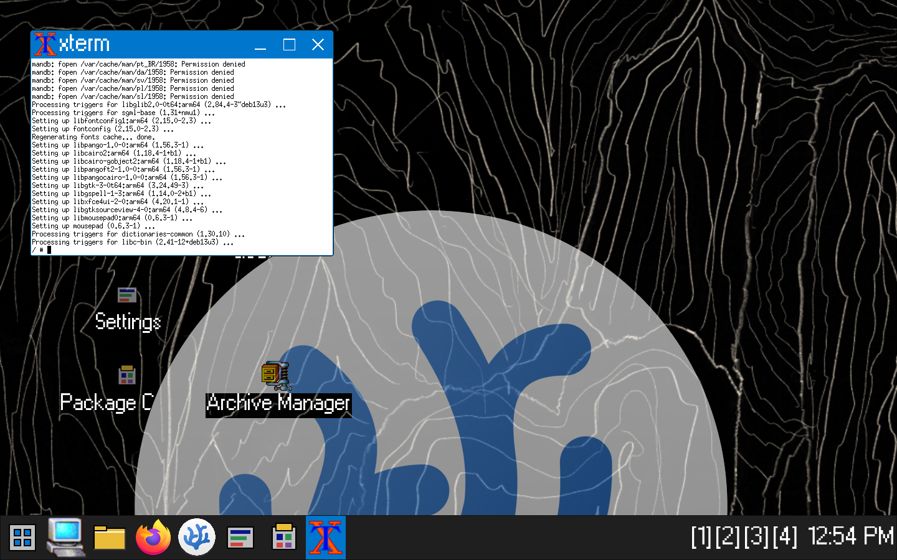
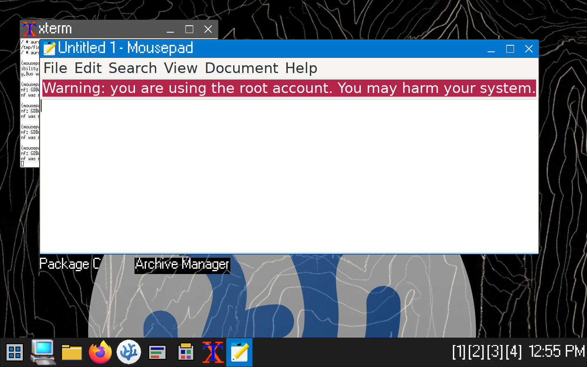

# AuroraOS 98

AuroraOS 98 is an experimental Linux operating-system environment for x86-64 PCs and Raspberry Pi hardware. It combines a classic desktop workflow with current Linux application compatibility: real windows, a Start menu, desktop icons, multiple workspaces, a graphical control center, and standard Linux software underneath.

> **Project status:** active development preview. Hardware-accelerated ARM64 and x86-64 QEMU images are runnable today. An experimental Raspberry Pi 4/5 hardware-test image is available; the production Wayland compositor, persistent installation, and update infrastructure are still under development.


## What works in the QEMU preview

- Linux 6.18 kernel and Alpine Linux userspace
- Xorg with the Aurora JWM desktop session
- 1440x900 desktop with large-interface scaling
- Start menu, taskbar, desktop icons, four workspaces, and keyboard launch shortcuts
- supplied Aurora pixel cursor theme built from `assets/cursors/aurora-pointer.png`
- supplied MS W98 UI pixel font across the desktop, controls, and application chrome
- real Firefox ESR with QEMU NAT networking
- real VSCodium, packaged for Alpine/musl
- PCManFM graphical file explorer
- native graphical Aurora Settings, Package Center, Task View, and System Monitor
- Wine launcher for Windows executables
- handlers for `.deb`, AppImage, Alpine/Android `.apk`, `.dmg`, shell scripts, and Linux executables
- graphical ZIP, 7-Zip, RAR, tar, gzip, bzip2, and xz archive handling
- Alpine `.apk` installation from the file explorer
- embedded Debian 13 ARM64/glibc runtime with `apt` dependency resolution for ARM64 `.deb` files
- Python 3 and pip
- NetworkManager tools, Wi-Fi controls for real hardware, and QEMU Ethernet networking
- VirtIO Sound/ALSA QEMU audio with Aurora click and startup sounds

## Real Firefox

AuroraOS bundles Firefox ESR with working QEMU NAT networking. This capture shows the browser loading a live external site inside the guest OS.


## Real VSCodium

AuroraOS bundles Alpine's native VSCodium package. It is not Lite XL, Lapce, a screenshot, or a fake editor window.


Press `F8` inside the VM to launch VSCodium. Press `F9` to open Aurora Settings.

## ARM64 Debian applications

The fast ARM64 image includes a real Debian 13 ARM64 userspace alongside the
Alpine desktop. Double-click an ARM64 `.deb` in Aurora Explorer to validate its
architecture, resolve dependencies with `apt`, install it, and generate Aurora
application and desktop launchers. Recommended-only dependencies are omitted to
keep live installs within the VM's memory-backed filesystem.



This test installed and launched Debian's real ARM64 Mousepad package:



The current QEMU image is a live preview. Packages installed after boot are lost
when the VM shuts down; persistent installation remains planned for the disk-image
edition.

## Aurora Settings

Settings is a native graphical application with System, Network & Wi-Fi, Sound, Appearance, Apps, and Workspaces pages.


## Project website

The static AuroraOS 98 project website lives in [`website/`](website/). It uses
the real QEMU screenshots and original repository assets, with no JavaScript
framework or build dependency.

Preview it locally with:

```sh
python3 -m http.server 8765 --directory website
```

Then open `http://127.0.0.1:8765`. The directory can also be deployed directly
to GitHub Pages or any static web host.

## Run it

### Fast start on Apple Silicon

The ARM64 image uses Apple's Hypervisor Framework (HVF). This is the recommended
way to run AuroraOS on an M1, M2, M3, or M4 Mac.

If the image has already been built, run:

```sh
make run-fast-qemu
```

You can also double-click `run-aurora-qemu.command` in Finder. It automatically
selects the fast ARM64 VM on Apple Silicon and the x86-64 VM on Intel hosts.

To install a launcher only for the current macOS user (no `sudo`, no changes to
other accounts), run:

```sh
make install-macos-user
open "$HOME/Applications/AuroraOS 98.app"
```

Remove that per-user launcher with `make uninstall-macos-user`. The launcher
references this checkout, so keep the project folder in place.

For a clean ARM64 build, run these once:

```sh
brew install qemu lz4 libarchive e2fsprogs xz
make firefox-qemu-arm64
make run-fast-qemu
```

Do not use `make run-firefox-qemu` on Apple Silicon unless you specifically need
the x86-64 guest. QEMU must translate every x86 instruction in software on an ARM
Mac, which is much slower than the HVF-backed ARM64 image.

### x86-64 hosts and compatibility testing

Build and run the x86-64 image with:

```sh
make firefox-qemu
make run-firefox-qemu
```

The x86-64 image is also the appropriate preview for testing Wine and x86 Windows
executables. The ARM64 image accepts Windows ARM64 PE files on a best-effort basis;
it does not translate x86/x64 Windows applications. Wine compatibility varies by
application and is not equivalent to Windows.

The fast ARM64 preview uses an Alpine desktop plus an embedded Debian 13/glibc
runtime. Aurora rejects `amd64`, `i386`, and other mismatched Debian packages
instead of forcing broken installations. Packages still need ARM64 builds and
dependencies available from Debian 13 repositories.

### Download compatibility

| Format | Current behavior |
| --- | --- |
| ARM64 Alpine `.apk` | Installs with Alpine's native package manager |
| Android `.apk` | Detected separately; installs only when the optional Waydroid runtime is present |
| Windows ARM64 `.exe` / `.msi` | Best-effort Wine ARM64 launch with architecture validation and optional desktop shortcut |
| x86 / x64 `.exe` | Use the x86-64 Aurora image; the ARM preview does not emulate x86 Windows applications |
| `.dmg` | Extracts files with 7-Zip into Downloads; macOS `.app` programs do not run on Linux |
| ARM64 AppImage | Runs directly or with the AppImage extract-and-run fallback |
| ARM64 `.deb` | Installs in the embedded Debian 13/glibc runtime; dependencies are resolved with `apt` and launchers are generated |

Android, Windows, Linux, and macOS all use different application ABIs. Matching
`arm64` CPU architecture is necessary, but it does not make packages from those
operating systems interchangeable.

### Debian 13

On an x86-64 Debian 13 PC, install the build and QEMU dependencies:

```sh
sudo apt update
sudo apt install git make python3 gcc qemu-system-x86 qemu-system-gui \
  cpio lz4 libarchive-tools xz-utils
git clone https://github.com/Abd196-bit/AuroraOS-98.git
cd AuroraOS-98
make firefox-qemu
make run-firefox-qemu-linux
```

The first build downloads the Alpine userspace and applications and needs about
8 GB of free disk space. The VM uses 6 GB RAM. For native-speed virtualization,
the user must have access to `/dev/kvm`; on a standard Debian installation:

```sh
sudo usermod -aG kvm "$USER"
```

Log out and back in after changing group membership. The Linux launcher falls
back to slower software emulation when KVM is unavailable.

### Requirements

- macOS or Linux host
- Python 3
- QEMU (ARM64 and/or x86-64 system emulator)
- `cpio`, `lz4`, `bsdtar`, and `make`
- at least 10 GB of free disk space for a clean ARM64 build
- 12 GB of RAM assigned to the ARM64 VM for live package installation

On macOS with Homebrew:

```sh
brew install qemu lz4 libarchive e2fsprogs xz
```

The first clean build downloads the Alpine package set. Generated images are written to:

```text
build/firefox-qemu/aurora-firefox-initramfs.cpio.lz4
build/firefox-qemu-arm64/aurora-firefox-initramfs.cpio.lz4
```

Build products are intentionally excluded from Git because the current image is close to 1 GB.

## Raspberry Pi 4 / Pi 5 test image

Download the experimental image from the
[pi-test-0.4 prerelease](https://github.com/Abd196-bit/AuroraOS-98/releases/tag/pi-test-0.4).
It requires a Pi 4 or Pi 5 with at least 4 GB RAM and a 2 GB or larger microSD
card. In Raspberry Pi Imager, choose **Use custom**, select the downloaded
`.img.xz`, choose the microSD card, and write it. The image runs from RAM and
does not preserve changes after reboot.

The image archive is also reproducible locally:

```sh
brew install mtools lz4 xz libarchive
make firefox-qemu-arm64
make pi-test-image
```

For a generic 5-inch 800×480 HDMI panel connected to HDMI0, download the
[fullscreen 800×480 image](https://github.com/Abd196-bit/AuroraOS-98/releases/download/pi-test-0.4/AuroraOS-98-Pi4-Pi5-test-0.4-800x480-fullscreen.img.xz)
or build it with `make pi-test-image-800x480`. This variant disables the legacy
firmware mode, forces the current KMS kernel display setting, prevents Xorg from
switching back to 1440×900, and uses a compact 46-pixel taskbar and 96-DPI app
layout so the complete desktop and Settings window fit the panel.

### Emulate a Raspberry Pi 4

This target runs the ARM64 build on QEMU's real `raspi4b` machine model with a
2 GB Pi 4, an 800×480 framebuffer, USB keyboard and tablet input, Alpine's small
hardware initramfs, and a persistent ext4 virtual SD root:

```sh
brew install qemu lz4 libarchive mtools e2fsprogs dtc
make firefox-qemu-arm64
make run-pi-qemu-smoke
```

The first build takes longer because it constructs the reduced Pi root. Later
runs can start the already-built VM directly with the QEMU command printed by
`make -n run-pi-qemu-smoke`. The Pi emulator is intended for display, input,
boot, and shell testing; use the standard ARM64 QEMU preview for internet and
full application testing.

### VM controls

- Click inside the QEMU window to use the mouse and keyboard.
- Press `Control+Option+G` on macOS to release the mouse from QEMU.
- Press `F7` for Firefox, `F8` for VSCodium, and `F9` for Settings.
- Open archives by double-clicking them in Aurora Explorer.
- Downloaded AppImages, `.apk` files, scripts, and executables can be opened from Aurora Explorer.
- Shut down from the Start menu before closing QEMU.

## Architecture

The runnable preview and the production architecture are intentionally separated.

| Layer | QEMU preview today | Production direction |
| --- | --- | --- |
| Kernel | Linux | Linux |
| Userspace | Alpine initramfs | Persistent Linux root filesystem |
| Display | Xorg with virtio-gpu | Wayland |
| Window manager | JWM | Aurora compositor/window manager |
| Desktop icons | iDesk | Aurora Desktop |
| Settings and system tools | Native Tk applications | Modular Aurora services and frontends |
| Networking | NetworkManager tools/QEMU NAT | NetworkManager with hardware Wi-Fi |
| Audio | ALSA/QEMU audio | PipeWire |
| Packages | Alpine packages in RAM preview | Native packages, Flatpak, and AppImage |

The initramfs preview is useful for developing and testing the complete desktop interaction loop. It is not a substitute for the persistent production root filesystem.

## Repository map

```text
assets/                 Aurora icons, artwork, fonts, and sound metadata
docs/                   Architecture, platform, behavior, and build notes
distro/                 Raspberry Pi and image definitions
packaging/               Default-app and optional-installer policy
rootfs-overlay/          Files overlaid onto production root filesystems
src/                     Aurora compositor, shell, services, and app sources
systemd/                 System and user service definitions
tools/                   QEMU image builders and development utilities
```

## Design direction

AuroraOS is keyboard-and-mouse first. The interface uses square windows, clear title bars, compact controls, visible state, and a desktop workflow instead of mobile-style navigation. The current preview uses a dark high-DPI theme while the design system and original Aurora artwork continue to evolve.

Every feature must improve at least one of usability, performance, compatibility, or developer experience.

## Known limitations

- The QEMU preview runs from RAM; changes are not persistent after shutdown.
- Packages installed while the preview is running are lost when it reboots.
- QEMU exposes Ethernet NAT, not the Mac's physical Wi-Fi radio.
- Unity Hub is proprietary and is represented by an official installer flow rather than redistributed in the base image.
- The Raspberry Pi 4/5 image is an unverified hardware-test build, not a stable
  release. It is RAM-based and non-persistent.
- The full Wayland/systemd/PipeWire production session is architectural work in progress.

## License and assets

Original AuroraOS source code is licensed under
[GPL-3.0-or-later](LICENSE). External applications and third-party material
keep their own licenses and copyright terms. The AuroraOS license does not
relicense fonts, sounds, screenshots, icons, artwork, or reference material
unless an accompanying file explicitly states otherwise. Raw third-party
reference repositories, downloaded package archives, and local icon-source
collections are excluded from this repository.

<iframe src="website/index.html" width="100%" height="500px" frameborder="0"></iframe>
