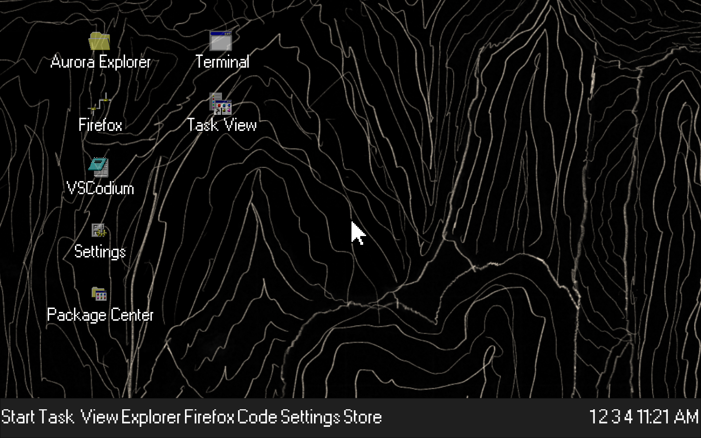
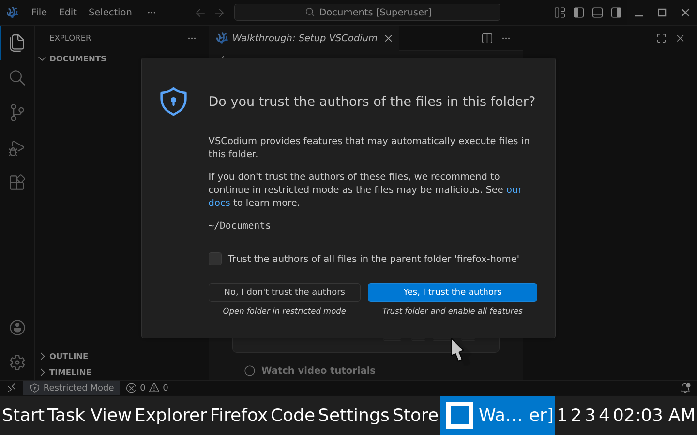
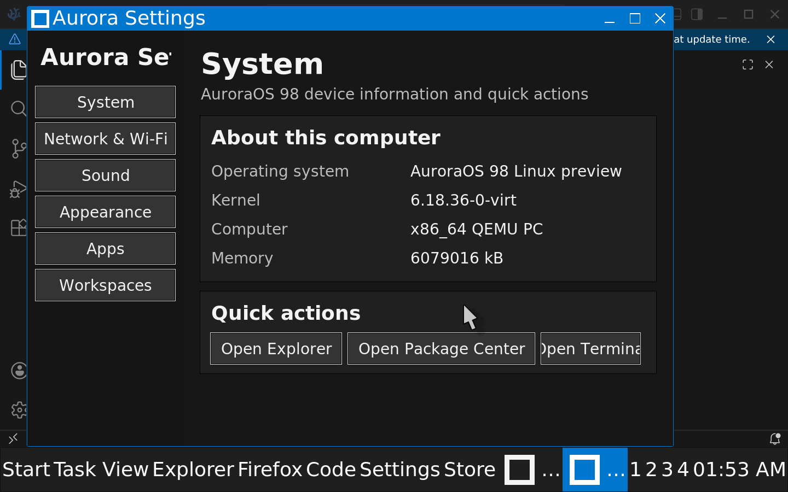

# AuroraOS 98

AuroraOS 98 is an experimental Linux operating-system environment for x86-64 PCs and Raspberry Pi hardware. It combines a classic desktop workflow with current Linux application compatibility: real windows, a Start menu, desktop icons, multiple workspaces, a graphical control center, and standard Linux software underneath.

> **Project status:** active development preview. Hardware-accelerated ARM64 and x86-64 QEMU images are runnable today. Raspberry Pi images, the production Wayland compositor, persistent installation, and update infrastructure are still under development.



## What works in the QEMU preview

- Linux 6.18 kernel and Alpine Linux userspace
- Xorg with the Aurora JWM desktop session
- 1440x900 desktop with large-interface scaling
- Start menu, taskbar, desktop icons, four workspaces, and keyboard launch shortcuts
- supplied Aurora pixel cursor theme built from `assets/cursors/aurora-pointer.png`
- supplied MS W98 UI pixel font across the desktop, controls, and application chrome
- real Firefox ESR with QEMU NAT networking
- real VSCodium, packaged for Alpine/musl
- PCManFM graphical file explorer
- native graphical Aurora Settings, Package Center, Task View, and System Monitor
- Wine launcher for Windows executables
- handlers for `.deb`, AppImage, shell scripts, and Linux executables
- graphical ZIP, 7-Zip, RAR, tar, gzip, bzip2, and xz archive handling
- Alpine `.apk` installation from the file explorer
- Python 3 and pip
- NetworkManager tools, Wi-Fi controls for real hardware, and QEMU Ethernet networking
- ALSA/QEMU audio plumbing and Aurora interface sounds

## Real Firefox

AuroraOS bundles Firefox ESR with working QEMU NAT networking. This capture shows the browser loading a live external site inside the guest OS.


## Real VSCodium

AuroraOS bundles Alpine's native VSCodium package. It is not Lite XL, Lapce, a screenshot, or a fake editor window.



Press `F8` inside the VM to launch VSCodium. Press `F9` to open Aurora Settings.

## Aurora Settings

Settings is a native graphical application with System, Network & Wi-Fi, Sound, Appearance, Apps, and Workspaces pages.



## Run it

### Fast start on Apple Silicon

The ARM64 image uses Apple's Hypervisor Framework (HVF). This is the recommended
way to run AuroraOS on an M1, M2, M3, or M4 Mac.

If the image has already been built, run:

```sh
make run-fast-qemu
```

You can also double-click `run-aurora-qemu.command` in Finder. It automatically
selects the fast ARM64 VM on Apple Silicon and the x86-64 VM on Intel hosts.

For a clean ARM64 build, run these once:

```sh
brew install qemu lz4 libarchive
make firefox-qemu-arm64
make run-fast-qemu
```

Do not use `make run-firefox-qemu` on Apple Silicon unless you specifically need
the x86-64 guest. QEMU must translate every x86 instruction in software on an ARM
Mac, which is much slower than the HVF-backed ARM64 image.

### x86-64 hosts and compatibility testing

Build and run the x86-64 image with:

```sh
make firefox-qemu
make run-firefox-qemu
```

The x86-64 image is also the appropriate preview for testing Wine and x86 Windows
executables. Wine in the ARM64 preview does not provide x86 CPU translation.

### Requirements

- macOS or Linux host
- Python 3
- QEMU (ARM64 and/or x86-64 system emulator)
- `cpio`, `lz4`, `bsdtar`, and `make`
- at least 8 GB of free disk space for a clean build
- at least 6 GB of RAM assigned to the VM

On macOS with Homebrew:

```sh
brew install qemu lz4 libarchive
```

The first clean build downloads the Alpine package set. Generated images are written to:

```text
build/firefox-qemu/aurora-firefox-initramfs.cpio.lz4
build/firefox-qemu-arm64/aurora-firefox-initramfs.cpio.lz4
```

Build products are intentionally excluded from Git because the current image is close to 1 GB.

### VM controls

- Click inside the QEMU window to use the mouse and keyboard.
- Press `Control+Option+G` on macOS to release the mouse from QEMU.
- Press `F7` for Firefox, `F8` for VSCodium, and `F9` for Settings.
- Open archives by double-clicking them in Aurora Explorer.
- Downloaded AppImages, `.apk` files, scripts, and executables can be opened from Aurora Explorer.
- Shut down from the Start menu before closing QEMU.

## Architecture

The runnable preview and the production architecture are intentionally separated.

| Layer | QEMU preview today | Production direction |
| --- | --- | --- |
| Kernel | Linux | Linux |
| Userspace | Alpine initramfs | Persistent Linux root filesystem |
| Display | Xorg with virtio-gpu | Wayland |
| Window manager | JWM | Aurora compositor/window manager |
| Desktop icons | iDesk | Aurora Desktop |
| Settings and system tools | Native Tk applications | Modular Aurora services and frontends |
| Networking | NetworkManager tools/QEMU NAT | NetworkManager with hardware Wi-Fi |
| Audio | ALSA/QEMU audio | PipeWire |
| Packages | Alpine packages in RAM preview | Native packages, Flatpak, and AppImage |

The initramfs preview is useful for developing and testing the complete desktop interaction loop. It is not a substitute for the persistent production root filesystem.

## Repository map

```text
assets/                 Aurora icons, artwork, fonts, and sound metadata
docs/                   Architecture, platform, behavior, and build notes
distro/                 Raspberry Pi and image definitions
packaging/               Default-app and optional-installer policy
rootfs-overlay/          Files overlaid onto production root filesystems
src/                     Aurora compositor, shell, services, and app sources
systemd/                 System and user service definitions
tools/                   QEMU image builders and development utilities
```

## Design direction

AuroraOS is keyboard-and-mouse first. The interface uses square windows, clear title bars, compact controls, visible state, and a desktop workflow instead of mobile-style navigation. The current preview uses a dark high-DPI theme while the design system and original Aurora artwork continue to evolve.

Every feature must improve at least one of usability, performance, compatibility, or developer experience.

## Known limitations

- The QEMU preview runs from RAM; changes are not persistent after shutdown.
- Packages installed while the preview is running are lost when it reboots.
- QEMU exposes Ethernet NAT, not the Mac's physical Wi-Fi radio.
- Unity Hub is proprietary and is represented by an official installer flow rather than redistributed in the base image.
- Raspberry Pi 4/5 boot images are not release-ready.
- The full Wayland/systemd/PipeWire production session is architectural work in progress.

## License and assets

Original AuroraOS source code is licensed under
[GPL-3.0-or-later](LICENSE). External applications and third-party material
keep their own licenses and copyright terms. The AuroraOS license does not
relicense fonts, sounds, screenshots, icons, artwork, or reference material
unless an accompanying file explicitly states otherwise. Raw third-party
reference repositories, downloaded package archives, and local icon-source
collections are excluded from this repository.
